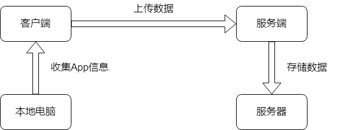

# Practicing Project
## 练手项目 Project Scope

### 最终成果

项目最终的名称就叫练手项目或Practicing Project，因为反正是用来练手的……项目最终应为完成的App(要有GUI吗？待定)，可运行于Win/Linux系统上。项目最终包含客户端和服务端两个部分，客户端能完整地实现收集指定社交App的数据，并上传到服务端；服务端能将收集到的数据存储于服务器的数据库里。

### 项目限制

**人数**：2人+（万一以后还会有人来呢。。。）

开发环境：C++（版本待定），CMake，Docker或虚拟机，CLion，SQL（具体版本待定）

库（已知）：libpcap

**参考书籍**：

- [Modern CMake for C++](https://usa1lib.org/book/19189796/777ba7)

（待未来填充……）

**时间**：自由宽裕

**可能需要的特点**：

- GUI
- Unit Test

**可能面对的困难**：

- 加密传输，基本上你什么都不能做
- 基本

### 阶段目标

- 完成配置开发环境，完成相关知识的学习

- 完成基础的服务端/客户端交互

  - 成功让服务端存储客户端发送的简单数据至数据库即可视作通过阶段

- 初步实现基础的抓取App数据

  - 采用Man In the Middle方式进行抓取。可参考Burp，Wireshark，iOS上的Stream；可能可以进一步参考Fiddler会提供哪些选项。。？
  - 弄清楚如何抓取HTTP的数据
  - 对HTTPS的信息需要生成SSL证书并能使本地认证该证书
  - 抓取后直接print出来即可视作通过阶段。可能需要考虑UTF-8等编码问题。。？

- 初步完成抓取App数据并上传至数据库里的完整功能

  - 服务端可以就是本地机。。。

  - 以任意方式存储成功即可视作通过阶段。同样可能需要考虑编码问题

- 后续优化、功能增强（越到后面越不切实际）：

  - 设计抓取的信息内容（要不要header？是否包含预处理？）、传输数据的统一格式（RAW？序列化？加密传输……？）
  - 设计存储信息的数据库table
  - 设计GUI方便浏览？
  - 尝试支持两三个社交App，在更以后的时候再考虑更多App。目前认为可以试水的App有Tinder，Discord，豆瓣（？？）
  - 设计各种额外功能的API，譬如专门从数据库中提取聊天记录文字的function，加密解密等（异想天开）
  - 多语言支持或调用，例如Rust/Python接口……
